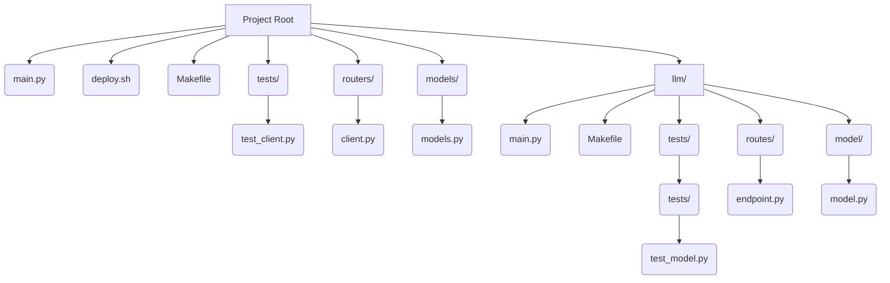
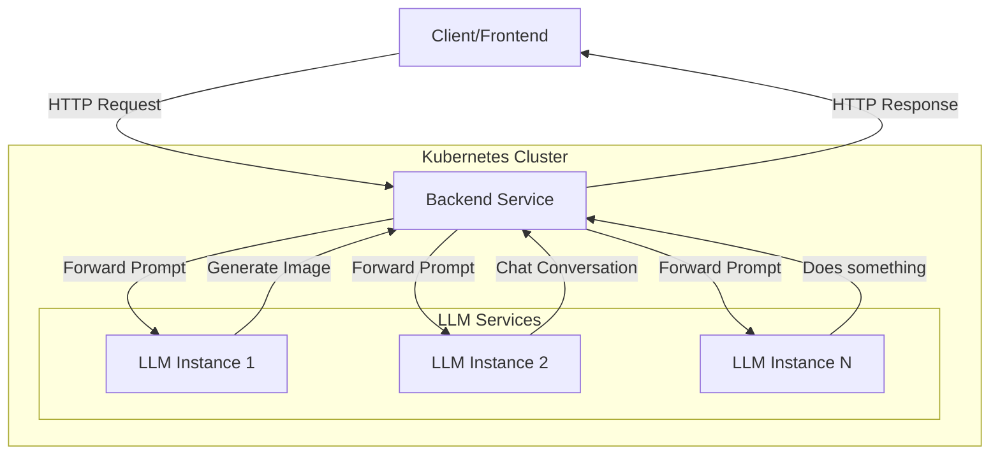

# LLM Backend

## Installation (Linux)
### Requirements
1. docker
2. minicube
3. hey (stress testing)

#### Doker installation
> [Follow docs.docker.com installation instructions](https://docs.docker.com/engine/install/ubuntu/#install-using-the-repository)

#### Minikube installation
> [Follow minikube.sigs.k8s.io installation instructions](https://minikube.sigs.k8s.io/docs/start/?arch=%2Flinux%2Fx86-64%2Fstable%2Fbinary+download)


#### Hey
Using ```hey``` to test HPA on /health
1. [Download `hey_linux_amd64`](https://hey-release.s3.us-east-2.amazonaws.com/hey_linux_amd64)
2. Move file from downloads to current directory and give exec premision:
    - ```mv ~/Downloads/hey_linux_64 ./hey```
    - ```chmod +x ./hey```

## Run Locally on kubernetes
Simply run ```make deploy```


## Run locally with python
>  Make a virtual environment ```python3 -m venv .venv``` and ```source .venv/bin/activate```.
> Preferably create a separate virtual environment for **backend** and for **llm**
1. Install dependencies
   - ```pip install -r requirements.txt```
2. Make sure to change the enpoint in ./routes/client.py to localhost:8081
3. Run server
   - ```make serve``` 
4. Go to llm/ directory ```cd ./llm``` and run:
   - ```pip install -r requirements.txt```
5. Run server
   - ```make serve```

# Project structure

# Architecture overview

Backend service will handle all requests which will forward the prompts to the service. Scales horizontally with minimal CPU & MEM usage.
Each LLM service runs independently from each other and scales vertically.

# Generate image using terminal
```curl
curl --header "Content-Type: application/json" \
 --request POST \
 --data '{"text": "**PROOMPT HERE**"}' \
 http://MinikubeIP:30081/model/generate \
 --output response.png
```

## Testing
###### Unit tests ```make test```
###### Stress testing ```make stresstest```
Make stresstest will run hey command that will create **n** requests to the http://\<**url**\>:**30080**/health/ endpoint, with the intention of increasing the CPU usage on the pod, thus triggering the autoscaling (HorizontalPodAutoscaler) to deploy an additional deployment to handle the heavy load

